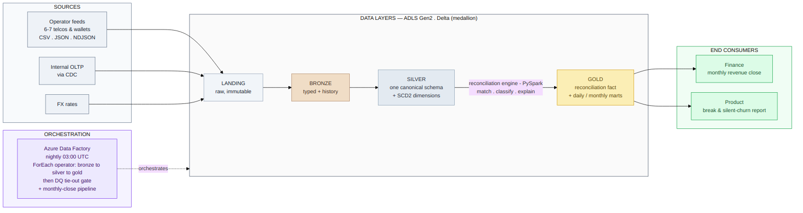
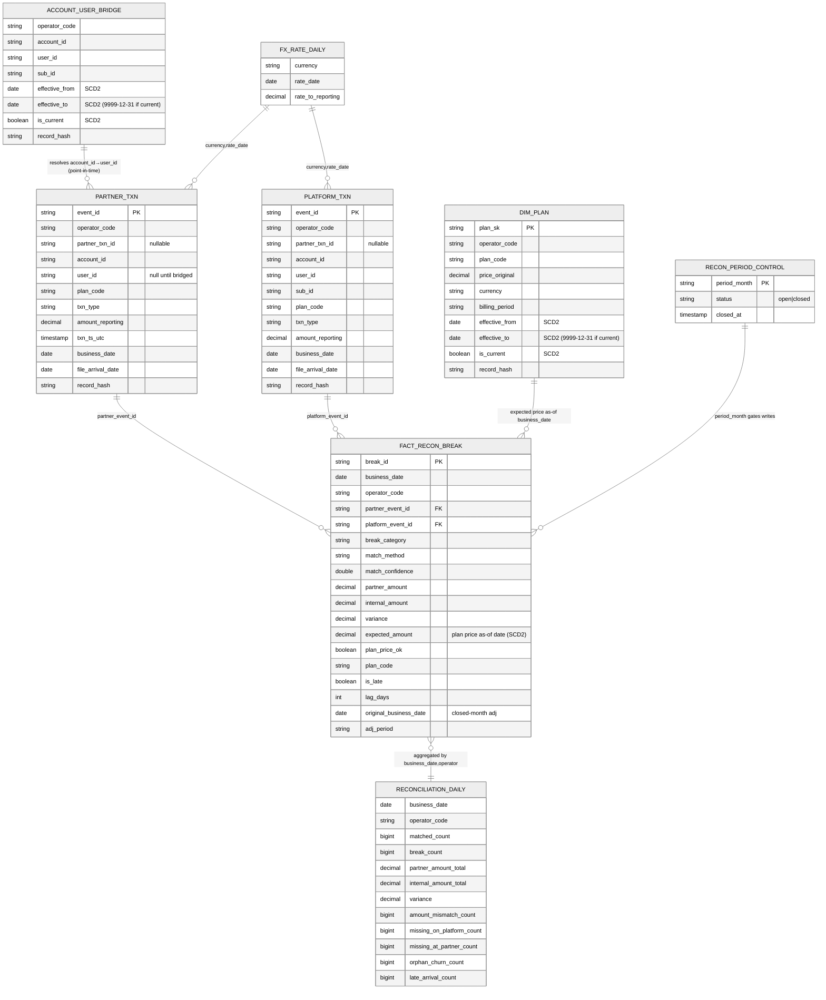
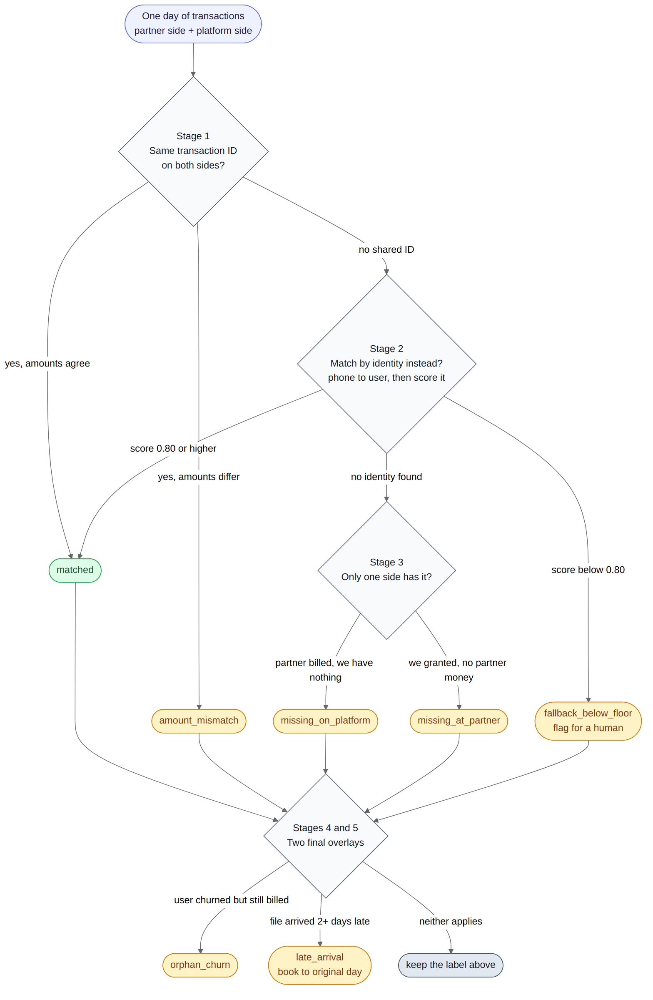

# Payments Reconciliation Across Partner and Internal Systems

A daily ETL pipeline that produces a **single reconciled view of subscriptions and
revenue**, telling Finance exactly where the **partner billing system** (the source of
truth for money) and the **internal OLTP** (the source of truth for entitlements)
disagree — *by how much, and why*.

> Stack as specified: **PySpark + Delta** on **Databricks/Fabric**, **ADF** for
> orchestration, **ADLS Gen2** for storage (medallion layout). A pure-Python
> reference engine is included so the full reconciliation logic is **runnable and
> verifiable without a Spark cluster** — it produced the sample output in this repo.

---

## 1. The problem, restated

Two systems independently record the same subscription life-cycle:

- The **operator/partner** feeds are where money actually moves. If a partner billed a
  user, revenue exists — regardless of what our platform thinks.
- The **internal OLTP** is where entitlements live. If our platform recorded a renewal,
  the user keeps their access — regardless of whether money arrived.

When these drift apart we get **silent revenue leakage** (we granted access but were
never paid) and **silent churn** (a user churned with us but the operator keeps
billing, or vice versa). Finance closes the books monthly and needs an **auditable**
number; Product needs the break list to chase the drift.

The deliverable is therefore not "a number" but a **defensible, restatable,
drill-downable reconciliation** with a classified reason for every disagreement.

The six break categories the engine must produce:

| Category | Meaning |
|---|---|
| `matched` | Same txn on both sides, amounts agree within tolerance |
| `amount_mismatch` | Same txn on both sides, amounts disagree beyond tolerance |
| `missing_on_platform` | Partner billed, but no entitlement record (**revenue we may not have provisioned / leakage**) |
| `missing_at_partner` | Platform granted entitlement, but no money (**access without payment**) |
| `orphan_churn` | User churned on platform yet partner still billing (or the reverse) |
| `late_arrival` | Txn arrived ≥2 days late; must merge into its *original* period without disturbing published numbers |

---

## 2. Architecture



A standard **medallion** on ADLS Gen2, all tables Delta, governed by Unity Catalog
(`recon.bronze` / `recon.silver` / `recon.gold` / `recon.control`):

```
abfss://recon@tapmadrecon.dfs.core.windows.net/
  landing/   raw immutable drops          (operator feeds + OLTP CDC + FX), partitioned by operator/arrival_date
  bronze/    Delta + lineage              idempotent MERGE keyed on a row hash
  silver/    canonical, conformed         partner_txn · platform_txn · account_user_bridge · fx_rate_daily
  gold/      facts & marts                fact_reconciliation_break · reconciliation_daily
  _control/  governance                   recon_period_control · recon_run_log · fx_raw
```

Why medallion here specifically: reconciliation is **re-run constantly** (a late file
forces yesterday to be recomputed). Keeping raw landing immutable and bronze
append-with-history means any historical day can be **reproduced exactly** from the
bytes we received, which is the whole game for an audited financial close.

### Orchestration (ADF)

- `pl_recon_daily` — runs 03:00 UTC. Looks up enabled operators from config, then a
  parallel `ForEach` lands + bronzes each feed, ingests OLTP CDC, builds silver
  (FX → normalize → platform), runs the gold engine and marts, and ends on a **DQ
  tie-out gate** (a `Fail` activity if partner/internal totals don't reconcile to the
  fact table). Config-driven: onboarding operator #8 adds a YAML block, not a pipeline.
- `pl_recon_month_close` — restates every day in the month with the latest data, then
  freezes the month in `recon_period_control`.

## 3. Data model (ERD)



Both source shapes conform to **one canonical transaction schema** (`partner_txn`,
`platform_txn`) so they are directly comparable. The grain of the gold fact
`fact_reconciliation_break` is **one row per reconciliation decision** (a matched
pair, or a single unmatched side), carrying `break_category`, `match_method`,
`match_confidence`, `variance`, and late/adjustment flags. `reconciliation_daily` is
the aggregate the case asks for; every count on it drills straight down to the fact
rows via `(business_date, operator_code)`.

---

## 4. Ingesting 6–7 differently-shaped feeds → one canonical stream

Normalization is **fully config-driven** (`config/operators.yaml`). Each operator is a
declarative block; the code is generic. The seven seeded operators deliberately cover
the messy realities:

| Operator | Format | Currency | The wrinkle it exercises |
|---|---|---|---|
| `telco_a` | clean CSV | NGN, Lagos tz | the happy path |
| `telco_b` | **nested JSON** | PKR | amount in **minor units** (paisa), **epoch-millis** ts |
| `telco_c` | semicolon CSV | TRY, Istanbul | **decimal comma**, `dd/MM/yyyy` dates |
| `telco_d` | CSV | BDT | **no `partner_txn_id` at all** → forces fallback matching |
| `wallet_x` | NDJSON | USD | ISO-8601 with offset |
| `telco_f` | CSV | LKR | **negative amount = refund** (contra-revenue) |
| `wallet_y` | (disabled) | INR | proves enable/disable is a config flag |

A new operator block specifies its `column_map`, `txn_type_map`, timestamp format and
timezone, `amount_scale`, decimal style, and currency. Nested JSON paths, minor-unit
scaling, decimal-comma parsing, and per-operator timezones are all handled by the
shared normalizer reading these declarations — **no per-operator code**.

### Joining the operator-suffixed OLTP tables

The OLTP exposes `sub_initial_{op}`, `sub_recursion_success_{op}`,
`sub_recursion_failure_{op}` per operator, plus a global `user_churn_events`. The
bronze CDC step **discovers tables dynamically** from the enabled-operator list, injects
`operator_code`, and `UNION ALL`s them with `unionByName(allowMissingColumns=True)` so a
new operator's tables are picked up automatically and schema drift across operators
doesn't break the union.

---

## 5. The reconciliation engine — a 5-stage decision tree



*(Full branch-level version, including the confidence-score breakdown and the
closed-month routing, is at `diagrams/decision_tree.png`.)*

Both sides are first restricted to **money-bearing** txn types and conformed to a
common reporting currency and a UTC-derived `business_date`. Then:

**Stage 1 — exact key match** on `(operator_code, partner_txn_id)`. Amounts compared
within tolerance `max(abs 0.01, pct 0.5%)` → `matched` or `amount_mismatch`. Confidence 1.0.

**Stage 2 — fallback identity match** for rows with **no usable `partner_txn_id`**
(telco_d, or null platform FKs). This is the subtle part the case calls out, so it is
designed conservatively:

- Resolve `account_id → user_id` via `account_user_bridge`. If identity can't be
  resolved, the row **cannot** fallback — it falls through to a break.
- The candidate join is **intentionally loose** — bridged identity + same `txn_type` +
  `business_date ± 1 day`. Amount is *not* a join predicate, so a weak-but-plausible
  pair still **forms** and can be scored.
- Additive **confidence score** (weights in `canonical_schema.yaml`):
  `identity 0.60 + amount-within-tol 0.20 + plan 0.10 + same-day 0.10`.
- **Floor = 0.80.** Identity alone (0.60), or identity+same-day (0.70), is **below the
  floor on purpose** — we require *monetary corroboration* before auto-matching a
  keyless transaction. Greedy 1:1 assignment by `(confidence desc, nearest timestamp)`.
- A candidate that scores **below the floor is not matched**. It stays a break tagged
  `match_method = fallback_below_floor` and surfaces in the daily review query. **This
  is the false-positive guard**: we would rather report a break a human can clear than
  silently fuse two unrelated transactions and hide real money movement.

**Stage 3 — residual classification.** Whatever is still unmatched on the target day:
partner-only → `missing_on_platform`, platform-only → `missing_at_partner`.

**Stage 4 — orphan-churn overlay.** If a user churned (`churn_ts ≤ business_date`) yet a
`recursion_success` exists after the churn, the row is overridden to `orphan_churn` —
the operator is still billing a churned user (real revenue, but a retention/dispute red
flag).

**Stage 5 — late-arrival overlay.** If `file_arrival_date − business_date ≥ 2`, the row
is flagged late and merged into its **original** business_date (see §6). If that period
is already closed, it becomes an **adjustment row** booked into the current open period.

---

## 6. Slowly-changing dimensions

The pipeline uses **both** SCD strategies, deliberately:

**SCD Type 1 (overwrite) for the event-stream tables.** Bronze, `partner_txn`,
`platform_txn`, and the OLTP CDC state are loaded with an idempotent
`whenMatchedUpdate(... record_hash changed ...)` merge. A transaction is an immutable
event — it doesn't *slowly change*, it only gets re-sent or corrected — so converging
each natural key to its latest version (Type 1) is the right and only sensible
semantic. History is preserved where it matters via the immutable `landing/` layer and
Delta time-travel, not by versioning the event rows.

**SCD Type 2 (effective-dated) for the true dimensions**, because two things genuinely
change over time *and* must be resolved as-of the transaction date for the close to be
reproducible:

- **`dim_plan`** — plan price / currency / billing terms. To validate an amount we need
  the price **in effect at the transaction's date**, not the latest price. If a plan's
  price changed mid-month and we stored it Type 1, re-running an already-closed day
  would silently pick up the newer price and change a published number. Type 2 keeps
  every version (`effective_from`, `effective_to`, `is_current`) and the engine resolves
  the right one with a point-in-time join. The fact now carries `expected_amount` (the
  contemporaneous plan price in reporting currency) and `plan_price_ok`, which turns a
  bare `amount_mismatch` into a *reason*: "the partner billed more than the plan in force
  that day." Built by `src/silver/build_dim_plan.py` via the generic `IO.scd2_merge`.
- **`account_user_bridge`** — an account/MSISDN can be reassigned to a different user
  (number recycling, transfer). Historical fallback matching must resolve to whoever the
  account mapped to **at the txn date**, so the bridge is effective-dated and Stage 2
  resolves identity point-in-time. Maintained as Type 2 in `src/silver/build_platform_txn.py`.

The shared `IO.scd2_merge` primitive implements the close-out-then-insert pattern
(change detected via a tracked-attribute `record_hash`); it's idempotent, so an
unchanged daily load is a no-op. **This is verifiable in the sample run** — `dim_plan`
shows two `PLN_A1` versions, and `plan_price_asof(...)` / `resolve_user_asof(...)`
return the *old* value for an early date and the *current* value for a late date
(scenarios S14/S15, covered by `tests/test_recon.py`):

```
PLN_A1 price  as-of 2026-05-10 -> 0.78 USD   (old version, effective 05-01..05-16)
              as-of 2026-05-29 -> 0.975 USD  (current version, effective 05-16..)
account 0777  as-of 2026-05-10 -> U_OLD
              as-of 2026-05-29 -> U_NEW      (reassigned 2026-05-20)
```

This is the same mechanism, applied consistently, that the FX handling already relies
on: resolve the value that was true *then*, never *now*.

## 7. The hard requirements, and how each is met

**Matching-key fallback & false-positive risk** — Stage 2 above. The risk is handled
explicitly with a confidence floor and a `fallback_below_floor` audit trail rather than
swept into a silent best-effort join.

**Idempotency on re-sends (operators re-send the prior 3 days).** Bronze and silver use
Delta `MERGE` keyed on a deterministic `record_hash`; a re-sent row updates in place
only if its content changed, so re-ingesting the same file is a no-op and re-sends never
double-count. Gold uses **dynamic partition overwrite** per `business_date` — re-running
a day fully *replaces* that day's facts rather than appending.

**Currency.** Amounts are converted to a single reporting currency (USD) using an
**as-of forward-filled FX rate** keyed on the transaction's own date — never today's
rate. This is what makes a historical re-run **reproduce the same number** months later.
Tolerance comparison happens in reporting currency.

**Timezone / local-vs-UTC.** Each feed's local timestamp is converted to UTC *first*,
and `business_date` is derived *from the UTC instant*. Doing it in this order prevents a
txn near local midnight from being assigned to the wrong day and manufacturing a
phantom break. (Seeded as scenario S12.)

**Re-statable historical reconciliation — the closed-period guard.** This is the
backbone of the audit story:

- The **open** month is fully recomputable: re-running a day overwrites its partition.
- A **closed** month is immutable. `recon_period_control` marks it `closed`, and the
  gold writers refuse to overwrite a closed partition. Corrections for closed periods
  are written as **adjustment rows** stamped with `original_business_date` (where it
  *should* have landed) and `adj_period` (the open month it's *booked* into). Published
  closed numbers never change; the adjustment is transparent and traceable.

---

## 8. Sample output (generated by the reference engine)

`data_gen/generate.py` seeds 16 scenarios — **one per edge case** — and
`data_gen/reference_engine.py` runs the identical decision tree in pandas and writes
`sample_output/`. Current run reproduces every category:

```
break_category        count        match_method           count
matched                  7         partner_txn_id            9   (exact-key pairs)
missing_on_platform      3         fallback_identity         1   (S8 keyless auto-match @0.90)
missing_at_partner       2         fallback_below_floor      2   (S9 guard: candidate @0.70, refused)
amount_mismatch          1         unmatched                 3
orphan_churn             1
late_arrival             1
```

Seeded scenarios → what they prove:

| # | Scenario | Proves |
|---|---|---|
| S1 | clean renewal, both sides | `matched` |
| S2 | platform 0.98 vs partner 1.30 USD | `amount_mismatch` |
| S3 | 0.975 vs 0.97 | rounding **within** tolerance still matches |
| S4 | partner-only billing | `missing_on_platform` |
| S5 | platform renewal, null partner FK | `missing_at_partner` |
| S6 | renewal after churn | `orphan_churn` overlay |
| S7 | partner file 3 days late | `late_arrival`, merged to original day |
| **S8** | telco_d, **no partner_txn_id** | **fallback identity match** @ 0.90 |
| **S9** | telco_d, identity resolves but amount wrong | **false-positive guard** → `fallback_below_floor` @ 0.70 |
| S10 | re-sent file | idempotency, no double count |
| S11 | NGN/PKR/TRY/BDT/LKR amounts | currency conversion |
| S12 | txn at local midnight | timezone day-boundary correctness |
| S13 | negative billing row | normalized to `refund` (contra-revenue) |
| **S14** | plan price change mid-month | **dim_plan SCD Type 2** — amount validated against the price *in effect at the txn date* |
| **S15** | account reassigned to a new user | **bridge SCD Type 2** — identity resolves point-in-time |
| **S16** | failed renewal (`sub_recursion_failure`) | non-revenue: ingested + conformed, but **excluded from matching** so it produces no break |

Files: `sample_output/partner_txn.csv`, `platform_txn.csv`, `dim_plan.csv`,
`fact_reconciliation_break.csv`, `reconciliation_daily.csv`,
`monthly_revenue_close.csv`.

---

## 9. Monthly revenue close (SQL)

`sql/marts/monthly_revenue_close.sql` computes gross, refunds, net, and
`variance_under_review` per operator for a parameter month, plus a **tie-out check**
(partner total − internal total = sum of signed variances; if not, the run is
suspect). `sql/marts/daily_break_report.sql` gives the daily health summary, full
drill-down, and the **fallback review queue** (both `fallback_below_floor` rejects and
thin-margin accepted matches). The audit trail is intrinsic: every mart number is
backed by fact rows carrying `match_method`, `match_confidence`, and the run timestamp.

---

## 10. Running it

**The reference engine (no cluster needed):**

```bash
cd tapmad-recon
python3 data_gen/generate.py          # writes synthetic feeds + OLTP to data_gen/out/
python3 data_gen/reference_engine.py  # runs the full decision tree -> sample_output/
```

**On Databricks/Fabric (production path):** create the tables with
`sql/ddl/01_create_tables.sql`, then run the pipeline in medallion order
(`src/bronze/* → src/silver/* → src/gold/*`) via `pl_recon_daily`. `src/common/config.py`
centralizes the ADLS account/container so it points at one place.

---

## 11. Assumptions

- The `account_user_bridge` is seeded here; in production it is **learned** from
  historically key-matched rows (every Stage-1 match teaches us an `account_id↔user_id`
  link), which is what makes Stage-2 fallback progressively stronger over time.
- One reporting currency (USD) for variance math; trivially configurable.
- "Late" = arrival ≥ 2 days after `business_date`, per the brief; configurable.
- Refunds are contra-revenue (subtract from gross). Failed recursions are non-revenue.
- CDC is modelled as latest-state-per-key with tombstones; CSV stands in for the CDC
  parquet/Delta source in the runnable sample.

---

## 12. Trade-offs & what I'd do with more time

- **Fallback confidence is a transparent linear score, not a learned model.** Chosen for
  auditability — Finance can read *why* a match was made. With more data I'd calibrate
  the weights/floor against analyst-confirmed outcomes (or a light classifier) while
  keeping the score explainable.
- **Greedy 1:1 fallback assignment**, not global optimal. Cheap and good enough at this
  grain; a Hungarian/optimal assignment would marginally improve dense ambiguous days at
  real cost.
- **DQ is a tie-out gate plus per-row flags** (`fx_missing`, `dq_unmapped_type`). I'd
  promote these to a first-class expectations suite (e.g. Delta Live Tables expectations)
  with quarantine tables.
- **Bridge learning is described but seeded.** Productionizing the feedback loop from
  Stage-1 matches into the bridge is the highest-value next step for keyless operators.
- **Plan dimension is SCD2 but plan↔txn linkage is simple.** Plans are effective-dated
  (Type 2) so amounts validate against the contemporaneous price; with more time I'd add
  proration handling for mid-cycle plan changes and a learned `plan_code` inference for
  feeds that omit it.

---

## Performance & scale

At the stated volumes (50k–500k rows/day/operator — megabytes, not terabytes) the costs
that matter are **shuffles** and **small Delta files**, so the tuning targets those
rather than raw compute:

- **Broadcast joins** for every small side — the `account_user_bridge`, `dim_plan`,
  `fx_rate_daily`, the churn lookup, and the rejected-candidate frames are wrapped in
  `F.broadcast(...)`, turning those joins into shuffle-free map-side joins. (`src/gold/reconciliation_engine.py`.)
- **AQE on** (`src/common/spark.py`) — runtime partition coalescing and skew-join
  handling, plus broadcast decisions based on measured sizes. `shuffle.partitions` is
  set to a modest 64 because the default 200 just makes hundreds of tiny partitions for
  MB-scale data.
- **Delta auto-compaction** — `optimizeWrite` + `autoCompact` (session config *and*
  table `TBLPROPERTIES`) so the daily MERGE/overwrite doesn't accumulate small files;
  no separate `OPTIMIZE` job needed.
- **Partition pruning** — silver/gold tables are partitioned by `operator_code` (and
  `business_date` for the gold fact), and every read filters on those, so a daily run
  scans only the relevant partitions. Column pruning is automatic for Delta.

Deliberately **not** done: broad `.cache()`/`.repartition()`. At this scale the inputs
are cheap to re-scan and pinning frames would cost more memory than it saves; if volumes
grew an order of magnitude the first move would be caching `partner`/`platform` per
operator and Z-ORDERing the gold fact on `(operator_code, partner_txn_id)`.


```
config/            operators.yaml (per-operator declarations) · canonical_schema.yaml (tolerances, weights, enums)
src/common/        config loader · idempotent IO (merge/overwrite/closed-period guard) · transforms (tz, fx, hash) · spark tuning (AQE/broadcast/Delta)
src/bronze/        operator-feed ingest · OLTP CDC ingest (dynamic discovery + union)
src/silver/        config-driven normalize · platform_txn builder + SCD2 bridge · SCD2 dim_plan builder · FX forward-fill
src/gold/          reconciliation_engine (5-stage) · build_marts · close_period
sql/ddl/           Unity Catalog DDL for all layers
sql/marts/         monthly_revenue_close · daily_break_report
orchestration/adf/ pl_recon_daily · triggers + month-close pipeline
diagrams/          architecture · system_design (+ numbered) · erd · decision_tree (+ simple) — .mmd source + rendered .png
data_gen/          generate.py (16 seeded scenarios) · reference_engine.py (runnable pandas mirror)
sample_output/     CSVs produced by the reference engine
```
